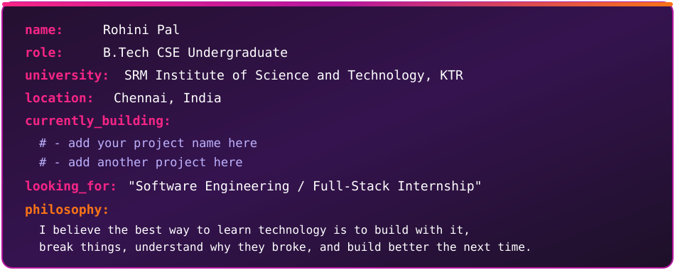

<div align="center">

<!-- Custom starfield banner — a real twinkling star background (SMIL animation inside the SVG), not just an emoji. This is a local file: banner-top.svg must sit in the same repo as your README, in the same folder, for the relative path below to work. -->


<a href="https://git.io/typing-svg">
  
</a>

<br/>

<!-- Stat badges row -->


<br/>


</div>

<br/>

## ⚡ About Me

<div align="center">



</div>

<br/>

<b>Focusing on:</b> Full-Stack Development · Backend Engineering · Data Structures & Algorithms · Databases · AI & Emerging Technologies

<br/>

## 🛠️ Tech Stack

<div align="center">

**Languages**


<br/><br/>

**Frontend & Backend**


<br/><br/>

**Databases**


<br/><br/>

**Tools & Platforms**


</div>

<br/>

## 💼 Internship Project

<!-- EDIT: this whole section is a template — swap in your actual internship project name, tagline, description, tech badges, feature rows, and links -->

<div align="center">

### 📊 Product Dashboard

A modern dashboard for managing products, data, and business insights.

A centralized dashboard that helps teams manage product information, track key metrics, and monitor operations in one place. It reduces manual data handling and makes product-related insights easier to access and act on.


<br/><br/>

| Feature | Feature | Feature |
|:---:|:---:|:---:|
| 📊 Dashboard & Insights | 📦 Product Management | 🔍 Search & Filtering |
| 🗂️ Data Organization | 📈 Analytics & Tracking | 📱 Responsive UI |

<!-- EDIT: add/remove table rows for each module or feature of the project -->

🌐 Live Demo: [product-dashboard-gamma-azure.vercel.app](https://product-dashboard-gamma-azure.vercel.app/login)

🔗 Repo: [JenisaRose/Product-Dashboard](https://github.com/JenisaRose/Product-Dashboard)

</div>

<br/>

## 🧩 CS Foundations

```
Data Structures & Algorithms
        |
        ▼
Database Management Systems
        |
        ▼
Operating Systems  →  Computer Networks
        |
        ▼
Object-Oriented Programming
        |
        ▼
Software Engineering
        |
        ▼
Web & Full-Stack Development
```

**Right now:** DSA → Problem Solving → Full-Stack Projects → System Design Basics

<br/>

## 📊 GitHub Activity

<div align="center">


</div>

## 🐍 Contribution Journey

<div align="center">


</div>

## 🧠 Problem-Solving Journey

Actively building interview-readiness through consistent, structured practice — not just random grinding.

🎯 **Current goal:** finish the DSA roadmap and keep a solving streak going through placement season

<div align="center">

`Arrays & Hashing` `Two Pointers` `Sliding Window` `Binary Search` `Linked Lists` `Stacks & Queues` `Trees & BST` `Graphs (BFS/DFS)` `Recursion & Backtracking` `Dynamic Programming` `Greedy Algorithms` `Heaps & Priority Queues` `Bit Manipulation` `Time & Space Complexity`

</div>

🔗 [My LeetCode Profile →](https://leetcode.com/u/HvVNU87CZ0/)

> Small daily reps beat last-minute cramming.

<br/>

## 📜 Certifications

<!-- EDIT: add/remove your own certifications, one bullet each -->
- 🏅 Coursera – Data Structures and Algorithms Specialization (UC San Diego): Ongoing specialization covering core DSA concepts and problem-solving in Python.
- 🏅 UpGrad – Generative AI Foundations (Microsoft): Foundation-level training in generative AI concepts and applications.
- 🏅 Coursera – Generative AI and LLMs: Architecture & Data Prep (IBM): Training in LLM architecture and data preparation fundamentals.

<br/>

## 🎯 Current Goal

```
   DSA & Problem Solving
          |
          ├──► Interview Readiness
          ▼
   Strong Full-Stack Projects
          |
          ├──► Portfolio That Stands Out
          ▼
   Resume & Applications
          |
          ├──► Targeted, Tailored Outreach
          ▼
   Interviews
          |
          ├──► Practice, Mocks, Feedback
          ▼
   SWE Internship 🚀
```

<br/>

## 🌸 Life Beyond Code

<!-- EDIT: swap this out for whatever's true for you — hobbies, sport, volunteering, music, whatever you want people to know -->
Outside of code, I'm into:
- 🎸 Music · Guitar
- 🎮 Gaming · Anime
- 👗 Fashion · College Fashion Club
- 🏆 Competitions · Team Events
- ✈️ Travel · Exploration

> <!-- add a short personal line or quote here -->

<br/>

## 📫 Let's Connect

<div align="center">

[](https://www.linkedin.com/in/rohini-pal-37b8a2242/)
[](https://leetcode.com/u/HvVNU87CZ0/)
[](mailto:rohini.pal009@gmail.com)
[](YOUR_RESUME_LINK)
[](https://github.com/JenisaRose)

</div>

<br/>

<div align="center">
<i>✨ Build. Break. Learn. Ship. Repeat. ✨</i>
</div>

<!-- Custom starfield footer banner — same twinkling-star treatment as the top -->

